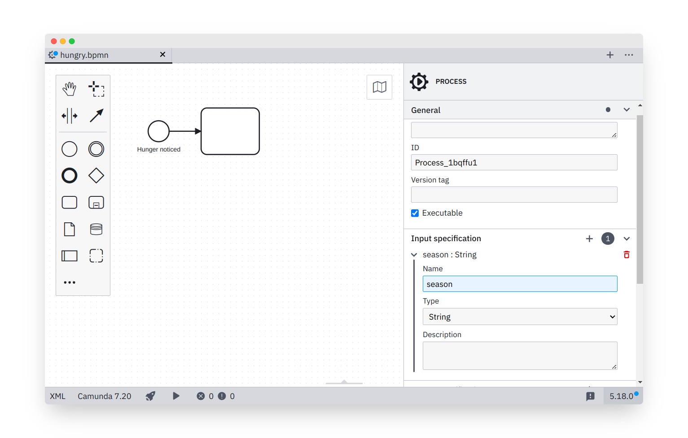

# Camunda Modeler Process I/O Specification Plug-in

[](https://github.com/camunda/camunda-modeler-process-io-specification-plugin/actions?query=workflow%3ACI) [](./README.md#compatibility-notice) [-orange.svg)](#)

This [Camunda Modeler Plugin](https://github.com/camunda/camunda-modeler) adds the ability to document required inputs and produced outputs of a BPMN 2.0 process. To do that it adds a `I/O Specification` tab to the BPMN editor properties panel.




## Details

The input and output mappings are not to be confused with [Camunda Input/Output variable mappings](https://docs.camunda.org/manual/latest/user-guide/process-engine/variables/#input-output-variable-mapping).

The meta-data is stored directly within the BPMN 2.0 diagram:

```xml
<bpmn:process id="process" isExecutable="true">
  <bpmn:extensionElements>
    <camunda:properties>
      <camunda:property name="input:orderNumber" value="int;The order number" />
      <camunda:property name="input:customerName" value="String;The customer's name" />
      <camunda:property name="output:billingAmount" value="double;The sum the customer has to pay" />
    </camunda:properties>
  </bpmn:extensionElements>
 ...
</bpmn:process>
```

It has __no execution semantics__ but may be read during process execution, i.e. via execution or BPMN parse listeners registered with the engine.


## Building

Install dependencies:

```sh
npm install
```

Package plugin to `client/client-bundle.js`:

```sh
npm run bundle

# or

npm run bundle:watch
```

## Compatibility Notice

This plugin is currently only compatible with following Camunda Modeler versions.

| Camunda Modeler | Plugin         |
|-----------------|----------------|
| 4.3 - 4.12      | 0.1.0          |
| 5.x             | 0.3.0 or newer |


## Additional Resources

* [Plugins documentation](https://docs.camunda.io/docs/components/modeler/desktop-modeler/plugins/)


## Licence

MIT
