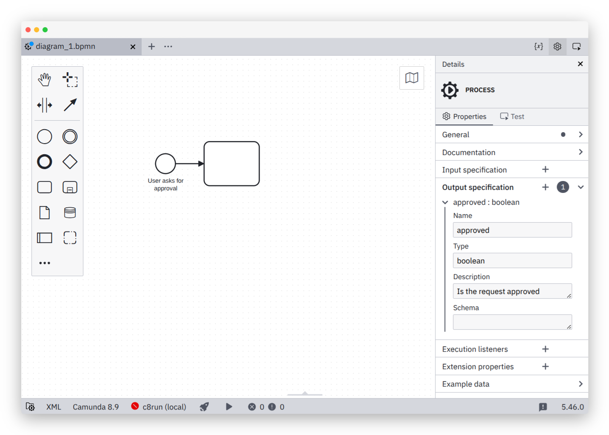

# Camunda Modeler I/O Specification Plug-in

[](https://github.com/camunda/camunda-modeler-process-io-specification-plugin/actions?query=workflow%3ACI)   -orange.svg)

This [Camunda Modeler Plugin](https://github.com/camunda/camunda-modeler) adds the ability to add I/O specification to [Camunda 8](https://docs.camunda.io/) processes and process elements.




## Details

> [!NOTE]
> The input and output specification is not to be confused with [input and output mappings](https://docs.camunda.io/docs/next/components/concepts/variables/#inputoutput-variable-mappings). I/O specification defines a contract, while mapping transforms and/or creates local variables.

The meta-data is stored directly within the BPMN 2.0 diagram:

```xml
<bpmn:process id="process" isExecutable="true">
  <bpmn:extensionElements>
    <ccon:ioSpecification>
      <ccon:inputSpecification name="firstName" description="The first name of the user" type="string" required="true" />
      <ccon:outputSpecification name="success" description="Was the operation successful?" type="boolean" required="true" />
    </ccon:ioSpecification>
  </bpmn:extensionElements>
 ...
</bpmn:process>
```

The definition has __no direct execution semantics__ but may be read during process execution, i.e. via execution or BPMN parse listeners registered with the engine.


## Building

Install dependencies:

```sh
npm install
```

Package plugin to `client/client-bundle.js`:

```sh
npm run bundle

# or

npm run bundle:watch
```

## Additional Resources

* [Plugins documentation](https://docs.camunda.io/docs/components/modeler/desktop-modeler/plugins/)


## Licence

MIT
